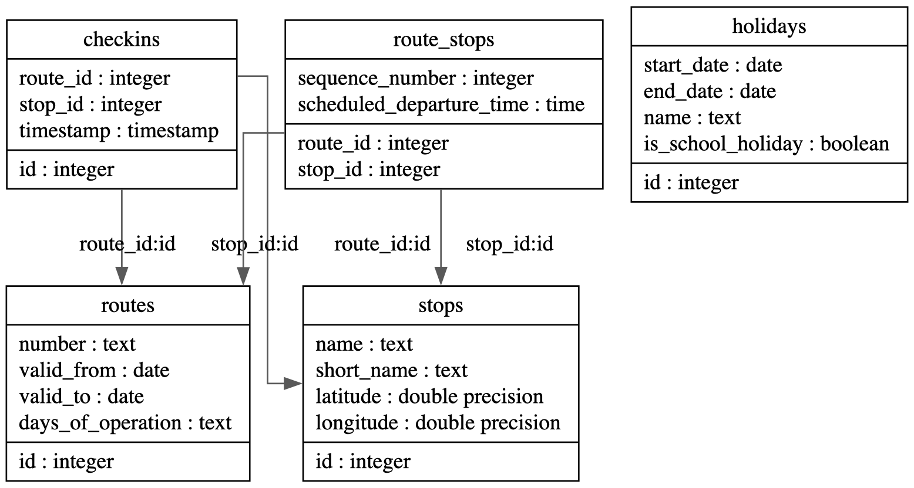

# NextStop

## Setup

Auführen von postgres in Docker:

`docker run --name nextstop-db -p 5455:5432 -e POSTGRES_USER=nextstop-admin -e POSTGRES_PASSWORD=nextstoppw -e POSTGRES_DB=nextstop -d postgres`

## Dokumentation

1. Für welches Datenmodell haben Sie sich entschieden



Hinweis: Die Entitäten für die Benutzerverwaltung mittels Keycloak wurden aus Übersichtlichkeitsgründen ausgeblendet.

2. Dokumentieren Sie auf Request-Ebene den gesamten Workflow anhand eines möglichst
durchgängigen Beispiels (vom Einpflegen der Haltestellen und Feiertage bis zur Planung
und Durchführung einer Fahrt). Sie können ein Tool Ihrer Wahl einsetzen, z. B. Postman

*Einpflegen der Haltestellen*:

POST /api/stops

Body:
```
{
  "name": "Linz Hauptbahnhof",
  "shortName": "HBH",
  "latitude": 48.2904,
  "longitude": 14.2914
}
```

*Einpflegen der Feiertage*:

POST /api/holidays

```
{
  "startDate": "2024-12-24",
  "endDate": "2024-12-26",
  "name": "Weihnachten",
  "isSchoolHoliday": true
}
```

*Erstellen einer Route*:

POST /api/routes

```
{
  "number": "311",
  "validFrom": "2024-01-01",
  "validTo": "2024-12-31",
  "daysOfOperation": "Weekday,Holiday",
  "stops": [
    { "stopId": 1, "sequenceNumber": 1, "scheduledDepartureTime": "06:00:00" },
    { "stopId": 2, "sequenceNumber": 2, "scheduledDepartureTime": "06:10:00" }
  ]
}
```

*Abfrage passender Fahrplanverbindungen*:

GET /api/routes/timetable?startStopId=2&endStopId=8&dateTime=2024-12-22&limit=1

Response:
```
[
  {
    "routeId": 1,
    "startStopId": 2,
    "endStopId": 8,
    "scheduledDepartureTime": "2024-12-22T06:05:00",
    "scheduledArrivalTime": "2024-12-22T06:40:00",
    "realDepartureTime": "2024-12-22T06:05:00",
    "realArrivalTime": "2024-12-22T06:40:00"
  }
]
```


3. Wie stellen Sie sicher, dass das Einchecken der Busse nur mit einem gültigen API-Key mög-
lich ist?

Die API-Endpoints sind durch die Authorize-Annotation gesichert, d.h. Requests ohne gültigen API-Key bekommen eine 401 Response.

4. Ein Angreifer hat Zugriff auf ein Datenbank-Backup Ihres Produktivsystems bekommen.
Welchen Schaden kann er anrichten?

Der Angreifer kann keinen direkten Schaden anrichten, da in der Datenbank keine Credentials gespeichert werden. Selbst von Keycloak werden nicht direkt die Passwörter gespeichert, nur gehashte Passwörter. Der Schaden wäre möglicher Leak von Informationen wie Checkin-Statistiken.

5. Bei welchen Teilen Ihres Systems ist eine korrekte Funktionsweise aus Ihrer Sicht am kri-
tischsten? Welche Maßnahmen haben Sie getroffen, um sie zu gewährleisten?

Abfrage von Abfahrtszeiten von Haltestellen und Fahrplanabfragen. Korrekte Funktionsweise wird durch ausführliche Unit-Tests sowohl auf DAO- als auch Controller-Ebene gewährleistet.

6. Wie haben Sie die Berechnung passender Routen bei Fahrplanabfragen modular umge-
setzt? Welche Teile Ihres Codes müssen Sie ändern, um eine andere Variante einzusetzen?

Die Fahrplanabfragen werden rein auf Datenbank-Ebene berechnet, d.h. für eine andere Variante müsste lediglich die Abfrage geändert werden, API-Endpoints bleiben unberührt (solange sich die Eingangsparameter nicht verändern)

7. Welche Prüfungen führen Sie bei einem Check-in (der Standortdaten eines Busses) durch,
um die Korrektheit der Daten zu gewährleisten?

Beim Check-in wird überprüft ob der angegebene Timestamp zeitlich plausibel ist, d.h nicht länger als 1h her. Außerdem muss die Haltestelle Teil der Route sein. Zusätzlich muss so wie bei anderen API-Endpoints ein gültiger Authorization Token verwendet werden.

8. Wie stellen Sie sicher, dass Ihre API auch in außergewöhnlichen Konstellationen (Jahres-
wechsel, Zeitumstellung, Feiertag in den Schulferien, etc.) stets korrekte Fahrplandaten
liefert?

Der Unterschied zwischen Schulferien und Feiertagen wird auf Datenbank-Ebene berücksichtigt, mittels der days_of_operation column im routes Table wird bestimmt ob die jeweilige Art von holiday für diese Route relevant ist oder nicht.

9. Bei der Übertragung eines API-Keys auf einen Bus ist etwas schiefgelaufen, der Bus liefert
mangels gültiger Authentifizierung keine Check-in-Daten mehr. Überlegen Sie, wie Sie a)
dieses Problem im Betrieb möglichst rasch erkennen können und b) Auskunft geben können, seit wann das Problem besteht.

Im Betrieb kann dies relativ rasch durch Requests-Logging/Monitoring erkannt werden, d.h. erhöhte Anzahl von 401 Responses bei Checkin-Endpoint. Der Beginn des Problems kann ausfindig gemacht werden durch eine einfache SQL Query nach dem letzten Check-in für die spezifische Route auf der der Bus fährt.

10. Denken Sie an die Skalierbarkeit Ihres Projekts: Die Wiener Linien möchten Ihr Produkt
mit über 1.000 Fahrzeugen nutzen. Was macht Ihnen am meisten Kopfzerbrechen?

Die Datenbank bzw. die API würde wahrscheinlich relativ schnell durch die Anfragen überlastet werden. Dies könnte eventuell durch Load-Balancing auf API-Ebene und Sharding auf Datenbank-Ebene gemildert werden. Auch Caching für häufige Anfragen wäre wahrscheinlich sinnvoll.

11. Wenn Sie das Projekt neu anfangen würden – was würden Sie anders machen?

Von Beginn an ein dezidiertes Access Identity Management System wie Keycloak verwenden und User-Daten nicht selbst in die Datenbank schreiben bzw. verwalten.